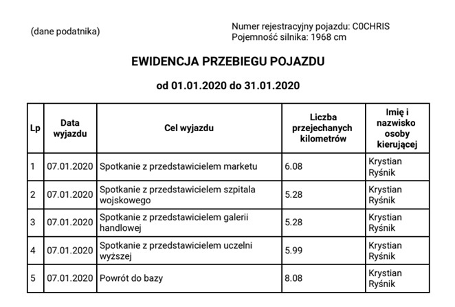

# Car Management App
Mobile app for easier tracking and logging vehicle mileage (BSc Thesis).
## Table of Contents
* [General Info](#general-info)
* [Technologies](#technologies)
* [Setup](#setup)
* [Screenshots](#screenshots)
## General Info
This work presents the way of designing and implementing a mobile application that
facilitates keeping vehicle mileage records using a registration and logging system,
geolocation and the ability to store data in an external database, including the ability to save
and read the route traveled, displaying the current position and generating a monthly report.
## Technologies
* Backend
	* Node.js
	* Express.js
	* MongoDB
	* JSON Web Tokens
* Frontend
	* React Native
	* Redux
	* Axios
	* Google Maps API
## Setup
1. Install node_modules
```
$ cd backend
$ npm install
$ cd ../frontend
$ npm install
```
2. Create file .env in both folders (backend & frontend).

**backend/.env**
```
MONGODB_URL={YOUR_MONGODB_URL}
JWT_KEY={YOUR_OWN_JWT_KEY}
PORT=3000
```

**frontend/.env**
```
GOOGLE_MAPS_API_KEY={YOUR_GOOGLE_MAPS_API_KEY}
```

3. Change server IP in **frontend/settings.js** in 4th line.
```
baseURL: 'https://car-management-backend.herokuapp.com/',
```

4. Run server & mobile app.
```
$ cd backend
$ npm run dev
$ cd ../frontend
$ npm start
or
$ npm run android
```

## Screenshots
Some screens from working app:


Generated report in PDF:


